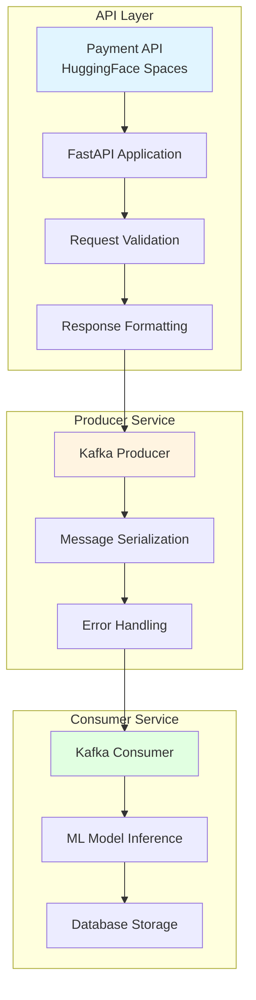
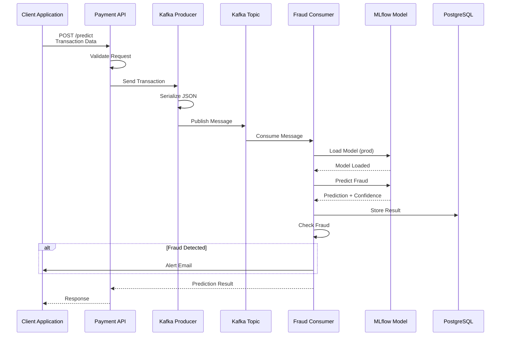
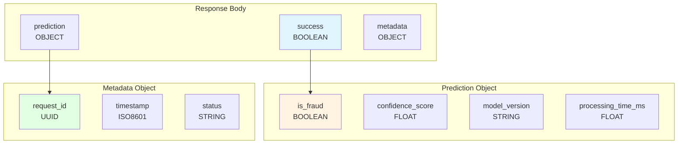
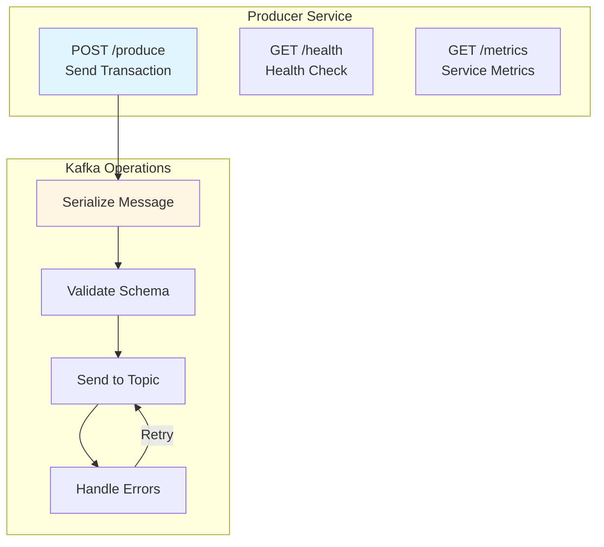
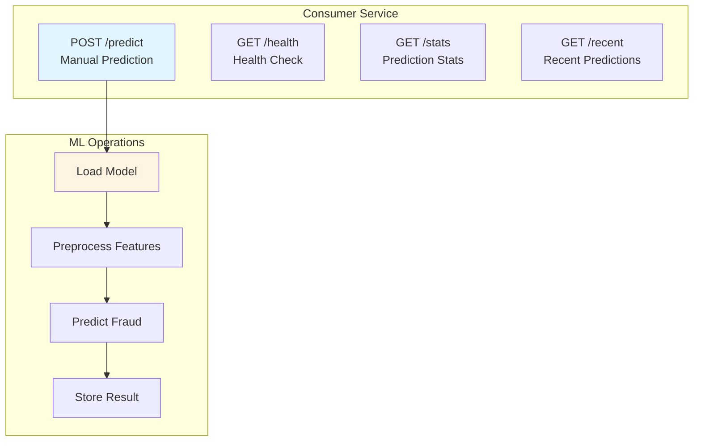
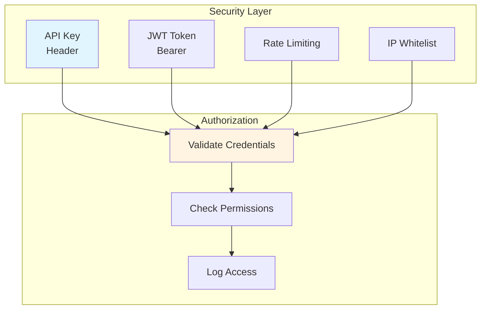
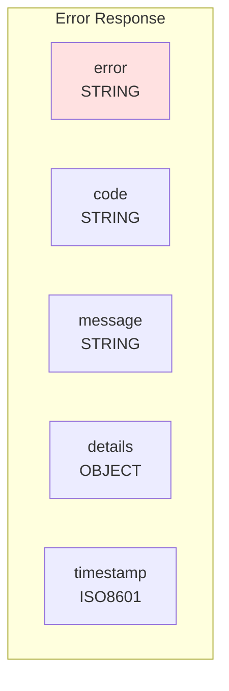
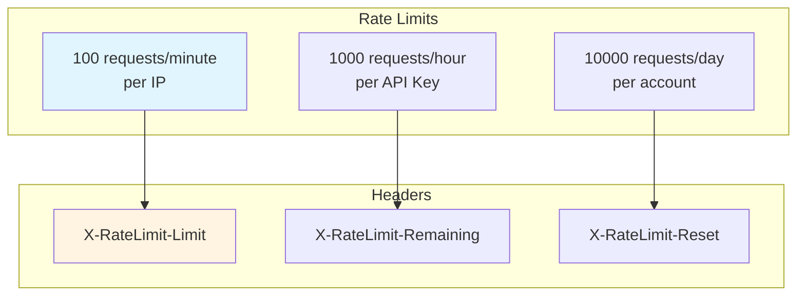

# API Documentation

## 🌐 API Endpoints

### Architecture API



## 📡 Payment API

### Endpoint: POST /predict



### Request Schema

```mermaid
graph TD
    subgraph "Request Body"
        RB1[transaction<br/>OBJECT]
        RB2[metadata<br/>OBJECT]
    end
    
    subgraph "Transaction Object"
        T1[trans_num<br/>STRING]
        T2[trans_date_trans_time<br/>STRING]
        T3[cc_num<br/>STRING]
        T4[merchant<br/>STRING]
        T5[category<br/>STRING]
        T6[amount<br/>FLOAT]
        T7[gender<br/>STRING]
        T8[street<br/>STRING]
        T9[city<br/>STRING]
        T10[state<br/>STRING]
        T11[zip<br/>INTEGER]
        T12[lat<br/>FLOAT]
        T13[long<br/>FLOAT]
        T14[city_pop<br/>INTEGER]
        T15[job<br/>STRING]
        T16[dob<br/>STRING]
        T17[unix_time<br/>INTEGER]
        T18[merch_lat<br/>FLOAT]
        T19[merch_long<br/>FLOAT]
    end
    
    subgraph "Metadata Object"
        M1[source<br/>STRING]
        M2[request_id<br/>UUID]
        M3[timestamp<br/>ISO8601]
    end
    
    RB1 --> T1
    RB1 --> T2
    RB2 --> M1
    
    style RB1 fill:#e1f5ff
    style T1 fill:#fff4e1
    style M1 fill:#e1ffe1
```



### Response Schema



### Example Request

```json
{
  "transaction": {
    "trans_num": "1234567890",
    "trans_date_trans_time": "2024-01-15 10:30:00",
    "cc_num": "************1234",
    "merchant": "Merchant Name",
    "category": "grocery_pos",
    "amount": 150.50,
    "gender": "F",
    "street": "123 Main St",
    "city": "New York",
    "state": "NY",
    "zip": 10001,
    "lat": 40.7128,
    "long": -74.0060,
    "city_pop": 8400000,
    "job": "Engineer",
    "dob": "1990-01-01",
    "unix_time": 1705319400,
    "merch_lat": 40.7138,
    "merch_long": -74.0070
  },
  "metadata": {
    "source": "payment_api",
    "request_id": "550e8400-e29b-41d4-a716-446655440000",
    "timestamp": "2024-01-15T10:30:00Z"
  }
}
```

### Example Response

```json
{
  "success": true,
  "prediction": {
    "is_fraud": false,
    "confidence_score": 0.9876,
    "model_version": "1",
    "processing_time_ms": 45.2
  },
  "metadata": {
    "request_id": "550e8400-e29b-41d4-a716-446655440000",
    "timestamp": "2024-01-15T10:30:00Z",
    "status": "completed"
  }
}
```

## 🔧 Producer API

### Producer Service Endpoints



### POST /produce

**Description:** Envoie une transaction au topic Kafka

**Request Body:**
```json
{
  "transaction": {
    "trans_num": "1234567890",
    "amount": 150.50,
    "category": "grocery_pos",
    ...
  }
}
```

**Response:**
```json
{
  "success": true,
  "message_id": "550e8400-e29b-41d4-a716-446655440000",
  "topic": "real-time-payments",
  "partition": 0,
  "offset": 12345
}
```

## 🎯 Consumer API

### Consumer Service Endpoints



### POST /predict

**Description:** Effectue une prédiction de fraude manuelle

**Request Body:**
```json
{
  "transaction": {
    "trans_num": "1234567890",
    "amount": 150.50,
    "category": "grocery_pos",
    ...
  }
}
```

**Response:**
```json
{
  "success": true,
  "prediction": {
    "is_fraud": false,
    "confidence_score": 0.9876,
    "model_version": "1"
  }
}
```

### GET /stats

**Description:** Récupère les statistiques de prédictions

**Response:**
```json
{
  "total_predictions": 10000,
  "fraud_predictions": 150,
  "fraud_rate": 0.015,
  "avg_confidence": 0.95,
  "model_version": "1"
}
```

### GET /recent

**Description:** Récupère les N dernières prédictions

**Query Parameters:**
- `limit`: Nombre de prédictions à retourner (défaut: 10)

**Response:**
```json
{
  "predictions": [
    {
      "trans_num": "1234567890",
      "is_fraud": false,
      "confidence_score": 0.9876,
      "prediction_time": "2024-01-15T10:30:00Z"
    }
  ]
}
```

## 📊 MLflow API

### MLflow Model Registry

```mermaid
graph TD
    subgraph "MLflow API"
        M1[GET /models/list<br/>List Models]
        M2[GET /models/{name}/versions<br/>List Versions]
        M3[GET /models/{name}/versions/{version}<br/>Get Version]
        M4[POST /models/{name}/versions/{version}/transition<br/>Transition Stage]
    end
    
    subgraph "Model Operations"
        O1[Register Model]
        O2[Set Alias]
        O3[Load Model]
        O4[Delete Model]
    end
    
    M1 --> O1
    M2 --> O2
    M3 --> O3
    M4 --> O4
    
    style M1 fill:#e1f5ff
    style O1 fill:#fff4e1
```

### GET /models/{name}/aliases/{alias}

**Description:** Charge un modèle par son alias

**Parameters:**
- `name`: Nom du modèle
- `alias`: Alias (ex: "prod")

**Response:**
```json
{
  "model_name": "fraud_detection_model",
  "version": "1",
  "alias": "prod",
  "run_id": "550e8400-e29b-41d4-a716-446655440000",
  "creation_timestamp": 1705319400000
}
```

## 🔐 Authentication

### API Security



### Headers

```
Authorization: Bearer <token>
X-API-Key: <api_key>
Content-Type: application/json
```

## ⚠️ Error Handling

### Error Response Format



### Error Codes

| Code | Description | HTTP Status |
|------|-------------|-------------|
| INVALID_REQUEST | Request validation failed | 400 |
| UNAUTHORIZED | Authentication failed | 401 |
| FORBIDDEN | Permission denied | 403 |
| NOT_FOUND | Resource not found | 404 |
| RATE_LIMIT_EXCEEDED | Too many requests | 429 |
| INTERNAL_ERROR | Server error | 500 |
| MODEL_ERROR | Model inference error | 500 |
| DATABASE_ERROR | Database operation failed | 500 |

### Example Error Response

```json
{
  "error": "INVALID_REQUEST",
  "code": "INVALID_REQUEST",
  "message": "Missing required field: amount",
  "details": {
    "field": "amount",
    "expected_type": "float"
  },
  "timestamp": "2024-01-15T10:30:00Z"
}
```

## 📈 Rate Limiting

### Rate Limits



## 🧪 Testing API

### Example cURL Commands

```bash
# Health Check
curl -X GET https://sdacelo-real-time-fraud-detection.hf.space/health

# Predict Fraud
curl -X POST https://sdacelo-real-time-fraud-detection.hf.space/predict \
  -H "Content-Type: application/json" \
  -H "Authorization: Bearer <token>" \
  -d '{
    "transaction": {
      "trans_num": "1234567890",
      "amount": 150.50,
      "category": "grocery_pos"
    }
  }'

# Get Stats
curl -X GET https://sdacelo-real-time-fraud-detection.hf.space/stats \
  -H "Authorization: Bearer <token>"

# Get Recent Predictions
curl -X GET "https://sdacelo-real-time-fraud-detection.hf.space/recent?limit=10" \
  -H "Authorization: Bearer <token>"
```
