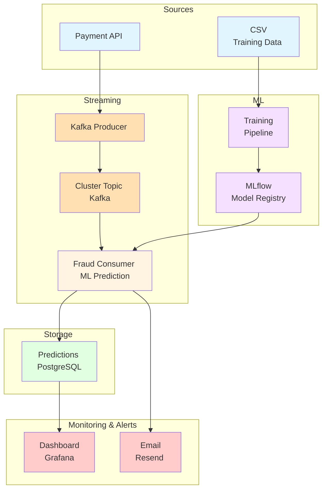

# Automatic Fraud Detection
  
## Besoins fonctionnels

Système de détection de fraude en temps réel utilisant l'IA pour analyser les transactions de paiement et alerter automatiquement en cas de suspicion.
- Être averti en temps réel qu'une fraude est détectée
- Une fois chaque matin, pouvoir vérifier tous les paiements et fraudes intervenus la veille.
  
## Architecture Globale

## Streaming avec Kafka (Aiven / Redpanda)

- **Pourquoi** : permettre le traitement **temps réel des transactions financières** dans une architecture event-driven.
- **Avantages** :
    - Découplage fort entre producteurs et consommateurs
    - Haute scalabilité horizontale (partitionnement des topics)
    - Tolérance aux pannes et reprise automatique
    - Possibilité de rejouer les événements (event replay)
    - Buffering naturel en cas de pics de charge
- **Alternative écartée** :
    - REST API directe → couplage fort, pas de buffering, non adapté aux pics
    - Airflow / batch processing → latence trop élevée, pas adapté au temps réel

---

## Architecture microservices (Producer / Consumer séparés)

- **Pourquoi** : séparation des responsabilités pour le traitement des flux de paiement et la détection de fraude.
- **Avantages** :
    - Scalabilité indépendante des composants (producer vs consumer)
    - Isolation des pannes (un consumer défaillant n’impacte pas le système global)
    - Déploiement et évolution indépendants
    - Meilleure maintenabilité du code
- **Alternative écartée** :
    - Monolithe → difficulté de scaling, couplage fort, point de défaillance unique

---

## MLflow pour le cycle de vie des modèles

- **Pourquoi** : centraliser la gestion du cycle de vie des modèles de Machine Learning via un système de tracking et de registry.
- **Rôle de MLflow** :
    - Tracking des expériences (metrics, paramètres, tags)
    - Versioning des modèles
    - Gestion des stages (Staging / Production)
    - Promotion contrôlée des modèles
- **Architecture associée** :
    - **Backend store** : PostgreSQL (ex : NeonDB) pour metadata (runs, metrics, registry)
    - **Artifact store** : stockage objet (S3 / Supabase Storage) pour les modèles et fichiers
- **Avantages** :
    - Traçabilité complète des expérimentations ML
    - Reproductibilité des modèles
    - Gouvernance du cycle de vie des modèles
- **Alternative écartée** :
    - Stockage manuel des modèles → absence de versioning, manque de traçabilité, risque d’erreur en production

## Base de données PostgreSQL (NeonDB)

- **Pourquoi** : stocker les résultats de scoring et assurer la persistance des décisions de fraude.
- **Avantages** :
    - Respect des propriétés ACID (cohérence des données critiques)
    - Requêtes SQL pour analyse et audit
    - Solution cloud-managed (NeonDB) facilitant la scalabilité
    - Adapté aux données structurées et historisées
- **Alternative écartée** :
    - NoSQL → non nécessaire ici, complexité inutile pour des données transactionnelles structurées

---

## Déploiement avec Hugging Face Spaces

- **Pourquoi** : déploiement rapide et accessible de services Python ML (API de scoring, prototypes).
- **Avantages** :
    - Mise en production rapide (low DevOps overhead)
    - Support Python natif
    - Gratuit pour un simple POC
- **Limites** :
    - Moins adapté aux workloads streaming intensifs ou haute performance
    - Scalabilité limitée comparée à une infrastructure cloud complète
- **Alternative écartée** :
    - AWS / GCP / Azure → plus puissant mais plus complexe et coûteux pour un simple POC

---

## Monitoring avec Grafana Cloud

- **Pourquoi** : assurer la visibilité des performances du système et du modèle ML.
- **Avantages** :
    - Dashboards temps réel
    - Alerting configurable (seuils, anomalies)
    - Intégration native avec PostgreSQL et autres sources de données
    - Centralisation des métriques système et métier
- **Alternative écartée** :
    - Dashboard custom → coût de développement élevé et maintenance complexe

---

## Service d’alerte email (Resend)

- **Pourquoi** : envoyer des notifications en cas de fraude détectée ou d’anomalies critiques.
- **Avantages** :
    - API simple et moderne
    - Bonne délivrabilité des emails
    - Intégration facile avec architectures serverless et microservices
- **Alternative écartée** :
    - SMTP direct → configuration complexe, faible fiabilité, mauvaise scalabilité

# Synthèse architecturale

Cette architecture repose sur 5 principes fondamentaux :

- **Event-driven architecture** (Kafka)
- **Découplage via microservices**
- **MLOps structuré (MLflow)**
- **Stockage transactionnel fiable (PostgreSQL)**
- **Observabilité et alerting en temps réel (Grafana + email)**

---

# Conclusion

Cette architecture est adaptée à un système de :

- détection de fraude temps réel
- traitement scalable des transactions
- cycle de vie ML industrialisé
- monitoring et alerting en production

Elle équilibre :

- simplicité (POC / projet)
- bonnes pratiques MLOps
- et extensibilité vers un système enterprise