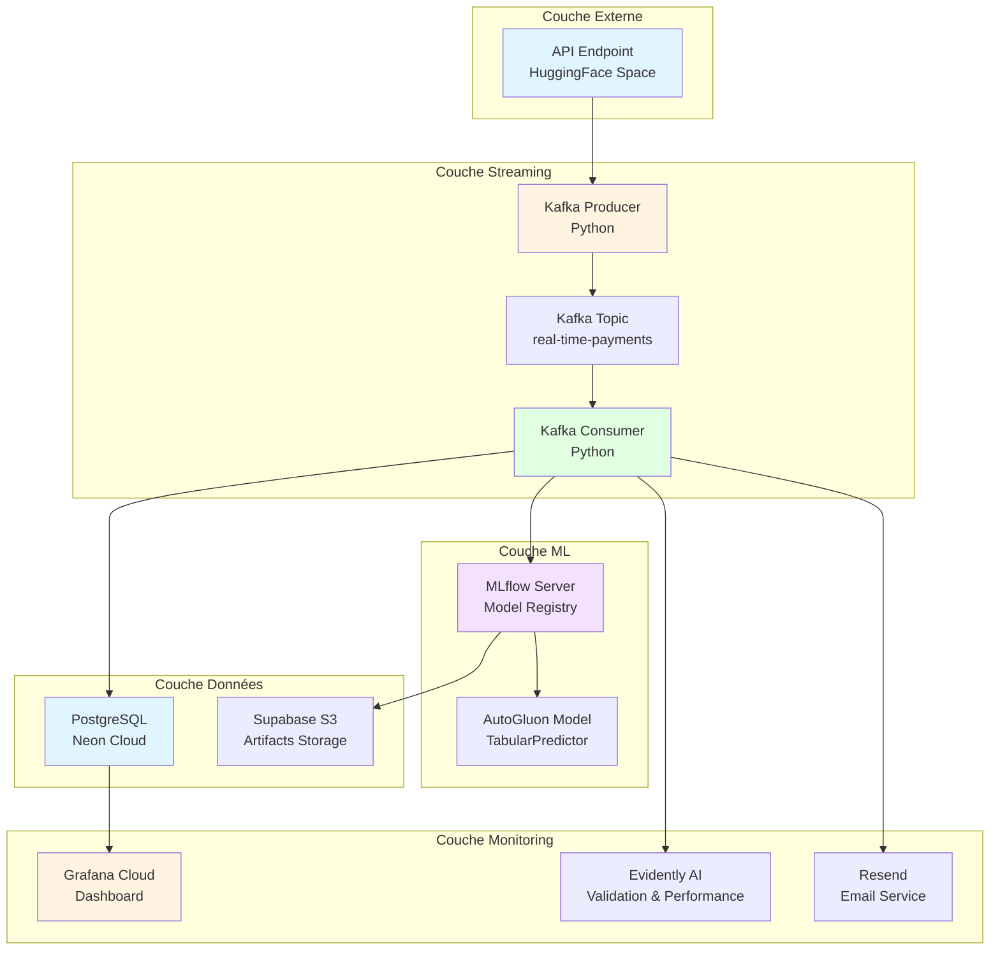
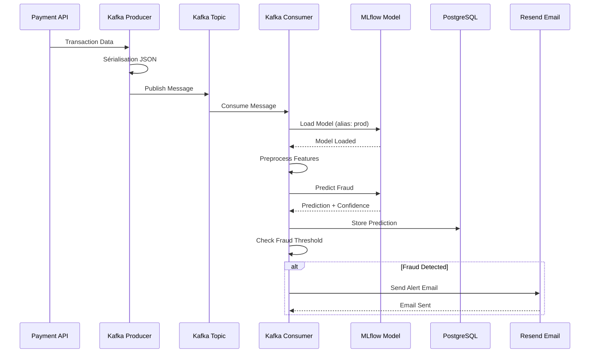
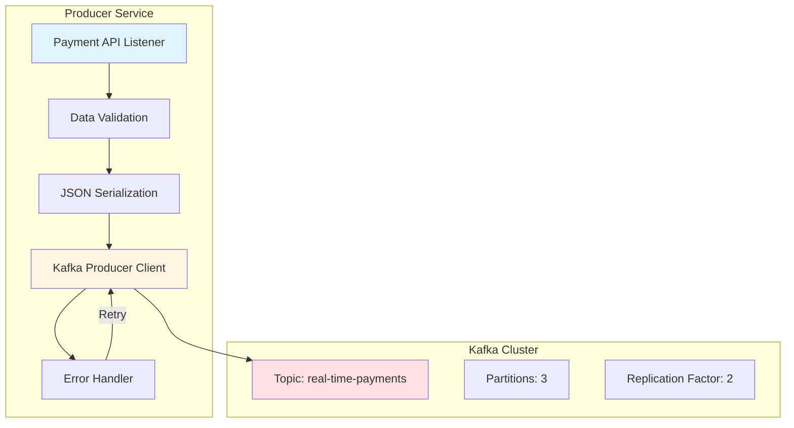
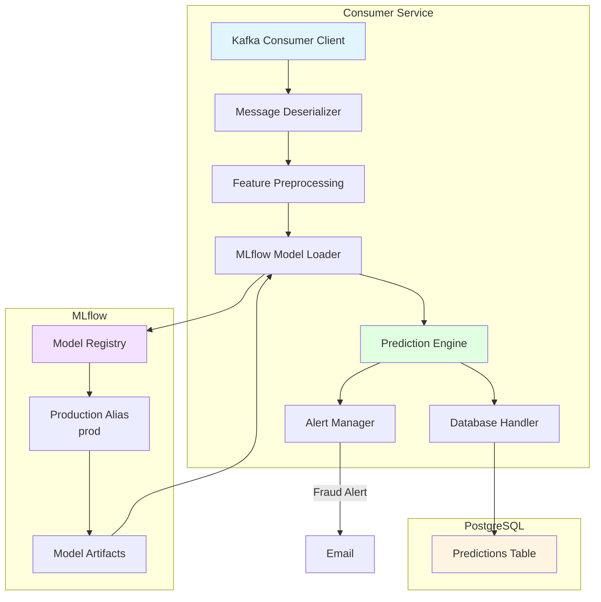
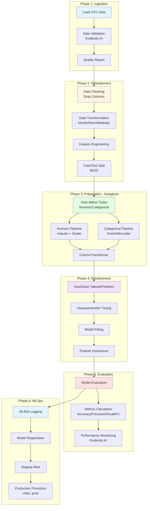
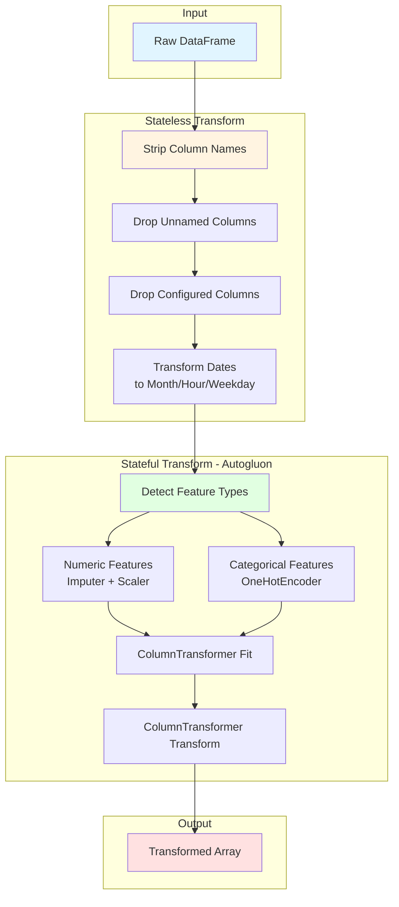
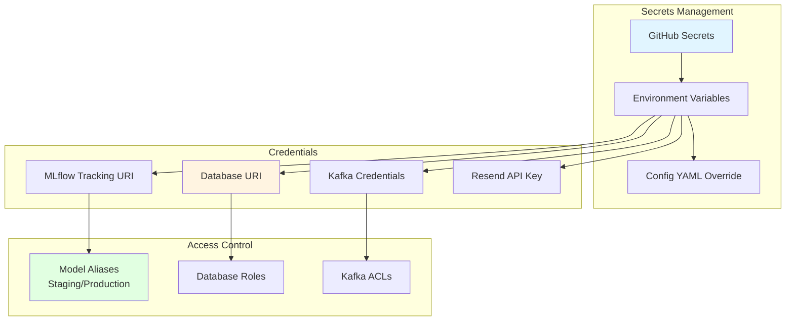
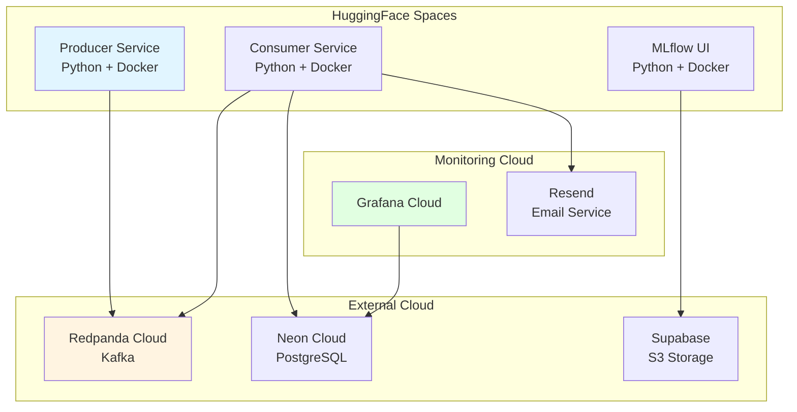

# Architecture Détaillée

## 🏛️ Vue d'ensemble de l'Architecture

Le système de détection de fraude est construit selon une architecture microservices orientée événements, utilisant Kafka pour le streaming temps réel et MLflow pour la gestion des modèles ML.

### Composants Principaux

## 🔄 Pipeline de Traitement Temps Réel

### Flux de Traitement

### Producer Service

**Fonctionnalités du Producer:**
- Écoute les événements de paiement depuis l'API
- Valide la structure des données
- Sérialise en JSON
- Publie sur le topic Kafka `real-time-payments`
- Gestion des erreurs avec retry automatique

### Consumer Service

**Fonctionnalités du Consumer:**
- Consomme les messages du topic Kafka
- Charge le modèle depuis MLflow via l'alias `prod`
- Prétraite les features (imputation, scaling, encoding)
- Génère les prédictions avec score de confiance
- Stocke les résultats en PostgreSQL
- Déclenche les alertes email en cas de fraude

## 🧠 Pipeline ML d'Entraînement

### Étapes du Pipeline

### Détail du Prétraitement

## 🔐 Sécurité et Gouvernance

### Gestion des Secrets

## 🚀 Infrastructure Cloud

### Déploiement sur HuggingFace Spaces

### Services et Endpoints

| Service        | URL                                                                                                                                                         | Description        |
| -------------- | ----------------------------------------------------------------------------------------------------------------------------------------------------------- | ------------------ |
| API Production | https://sdacelo-real-time-fraud-detection.hf.space/                                                                                                         | Endpoint principal |
| MLflow UI      | https://jefraudai-mlflow.hf.space/#/models                                                                                                                  | Interface MLflow   |
| Producer       | https://huggingface.co/spaces/jefraudai/Producer                                                                                                            | Service Producer   |
| Consumer       | https://huggingface.co/spaces/jefraudai/consumer                                                                                                            | Service Consumer   |
| Kafka          | https://cloud.redpanda.com/clusters/d8c0ur6uk85ifvcgnlrg/topics/real-time-payments/                                                                         | Cluster Redpanda   |
| Dashboard      | https://jefraudai.grafana.net/public-dashboards/44a8ad6003bc4887880bfcfb8ebb6598?from=2023-12-04T13:55:58.556Z&to=2028-12-03T13:55:58.556Z&timezone=browser | Grafana Dashboard  |
