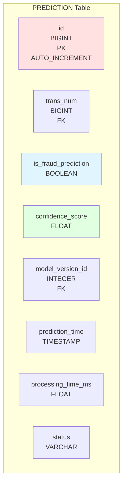

# Schéma de Données

## 📊 Vue d'ensemble du Schéma

Le système utilise PostgreSQL comme base de données principale pour stocker les prédictions de fraude.

## 🗄️ Schéma de Base de Données

## 📋 Structure des Tables

### Table: PREDICTION



**Colonnes principales:**
- `id`: Identifiant unique de la prédiction
- `trans_num`: Référence vers la transaction
- `is_fraud_prediction`: Prédiction du modèle (0/1)
- `confidence_score`: Score de confiance (0-1)
- `model_version_id`: Version du modèle utilisée
- `processing_time_ms`: Temps de traitement en millisecondes


## 📦 Schéma des Données Kafka

### Exemple de Message JSON

```json
{
  "message_id": "550e8400-e29b-41d4-a716-446655440000",
  "timestamp": "2024-01-15T10:30:00Z",
  "transaction": {
    "trans_num": "1234567890",
    "trans_date_trans_time": "2024-01-15 10:30:00",
    "cc_num": "************1234",
    "merchant": "Merchant Name",
    "category": "grocery_pos",
    "amount": 150.50,
    "gender": "F",
    "street": "123 Main St",
    "city": "New York",
    "state": "NY",
    "zip": 10001,
    "lat": 40.7128,
    "long": -74.0060,
    "city_pop": 8400000,
    "job": "Engineer",
    "dob": "1990-01-01",
    "unix_time": 1705319400,
    "merch_lat": 40.7138,
    "merch_long": -74.0070
  },
  "metadata": {
    "source": "payment_api",
    "producer_id": "producer-1",
    "partition": 0,
    "offset": 12345
  }
}
```

