# Déploiement

## 🚀 Vue d'ensemble du Déploiement

Le projet est déployé sur HuggingFace Spaces avec des services cloud externes pour Kafka, PostgreSQL et le stockage.

## 🏗️ Architecture de Déploiement

### Infrastructure Cloud

```mermaid
graph TD
    subgraph "HuggingFace Spaces"
        HF1[Producer Service<br/>Docker]
        HF2[Consumer Service<br/>Docker]
        HF3[MLflow UI<br/>Docker]
        HF4[API Endpoint<br/>FastAPI]
    end
    
    subgraph "Redpanda Cloud"
        RP1[Kafka Cluster]
        RP2[Topic: real-time-payments]
        RP3[Partitions: 3]
    end
    
    subgraph "Neon Cloud"
        NE1[PostgreSQL Database]
        NE2[Pooled Connections]
        NE3[Auto-scaling]
    end
    
    subgraph "Supabase"
        SB1[S3 Storage]
        SB2[MLflow Artifacts]
        SB3[Bucket: mlflow-artifacts]
    end
    
    subgraph "Grafana Cloud"
        GF1[Dashboard]
        GF2[Metrics Collection]
        GF3[Alerting]
    end
    
    subgraph "Resend"
        RS1[Email Service]
        RS2[API Integration]
        RS3[Alert Delivery]
    end
    
    HF1 --> RP1
    HF2 --> RP1
    HF2 --> NE1
    HF3 --> SB1
    HF2 --> GF1
    HF2 --> RS1
    
    style HF1 fill:#e1f5ff
    style RP1 fill:#fff4e1
    style NE1 fill:#e1ffe1
    style GF1 fill:#ffe1e1
```

## 🐳 Docker Configuration

### Producer Dockerfile

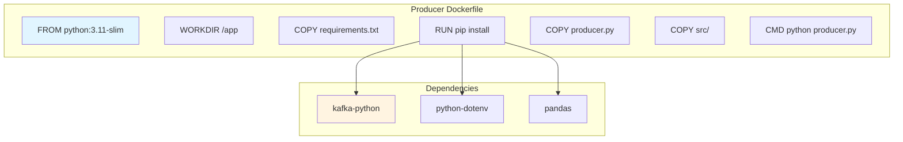

### Consumer Dockerfile

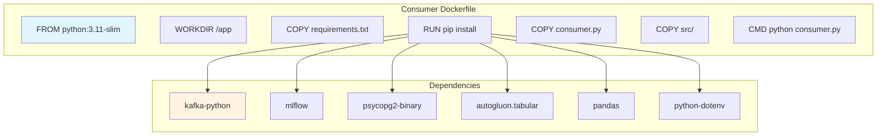

## 📦 Services HuggingFace Spaces

### Producer Service

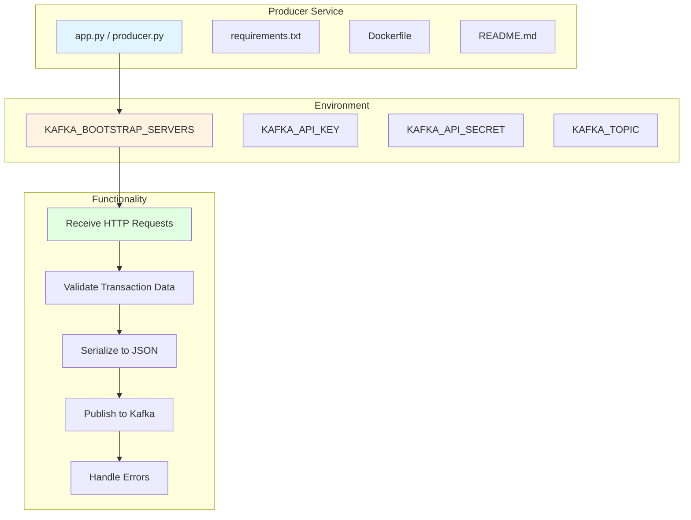

**URL:** https://huggingface.co/spaces/jefraudai/Producer

### Consumer Service

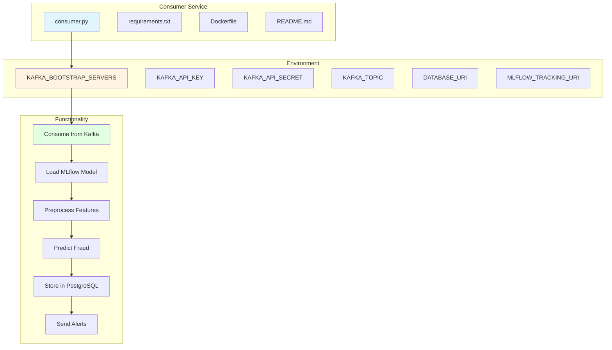

**URL:** https://huggingface.co/spaces/jefraudai/consumer

### MLflow UI

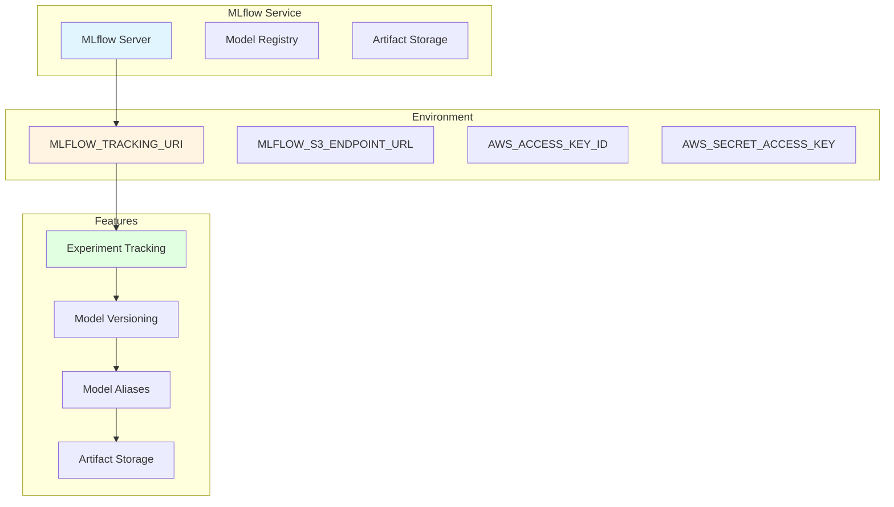

**URL:** https://jefraudai-mlflow.hf.space/#/models

## ☁️ Services Cloud Externes

### Redpanda Cloud (Kafka)

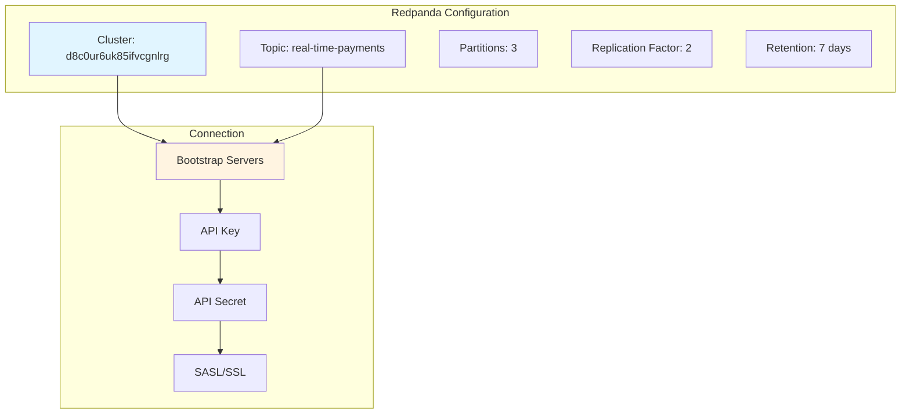

**URL:** https://cloud.redpanda.com/clusters/d8c0ur6uk85ifvcgnlrg/topics/real-time-payments/

### Neon Cloud (PostgreSQL)

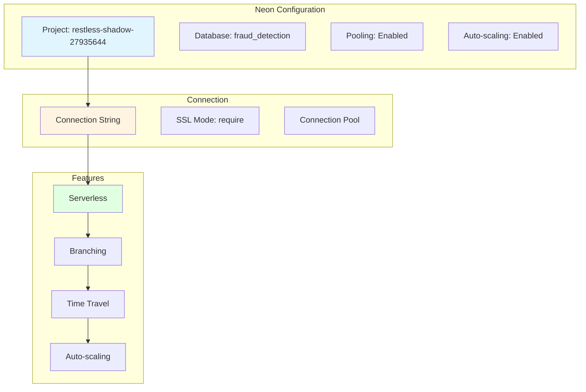

**URL:** https://console.neon.tech/app/projects/restless-shadow-27935644

### Supabase (S3 Storage)

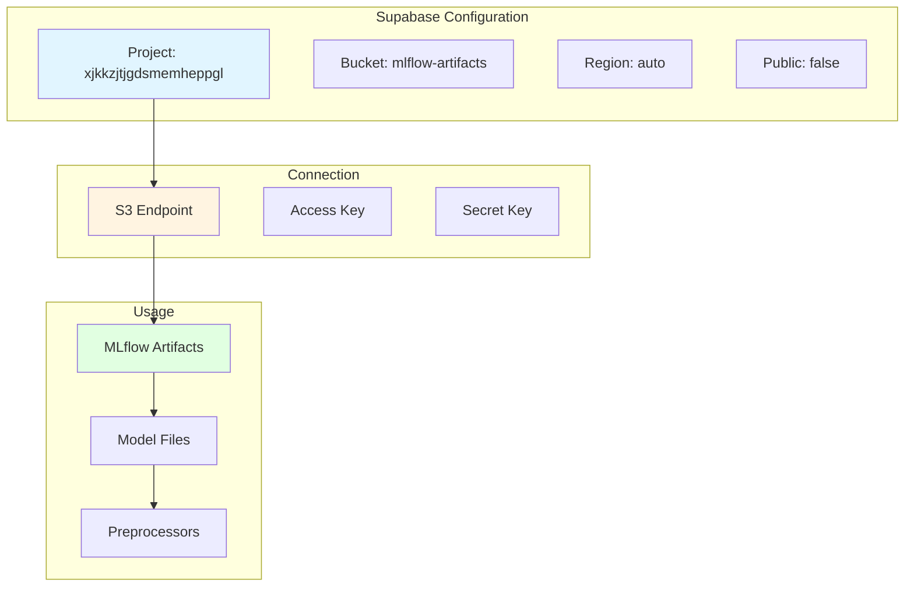

**URL:** https://supabase.com/dashboard/project/xjkkzjtjgdsmemheppgl/storage/files/buckets/mlflow-artifacts

### Grafana Cloud

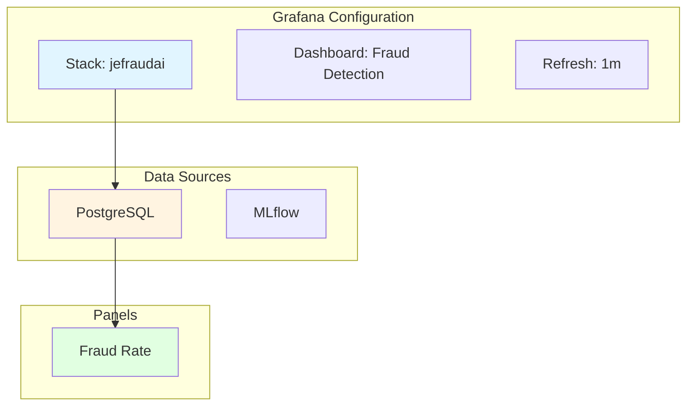

**URL:** https://jefraudai.grafana.net/public-dashboards/44a8ad6003bc4887880bfcfb8ebb6598?from=2023-12-04T13:55:58.556Z&to=2028-12-03T13:55:58.556Z&timezone=browser

### Resend (Email Service)

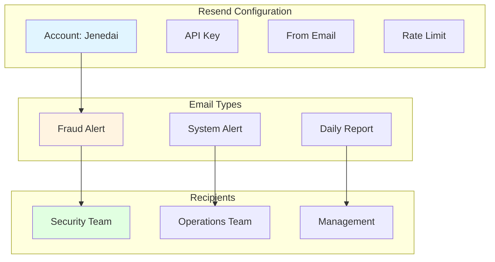

**URL:** https://resend.com/

## 🔧 Configuration du Déploiement

## 🔄 CI/CD Pipeline

### GitHub Actions Workflow

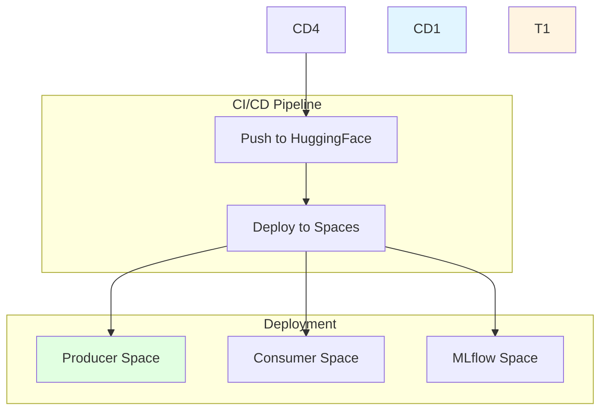

## 📊 Monitoring en Production

### Stack de Monitoring (Non implémenté)

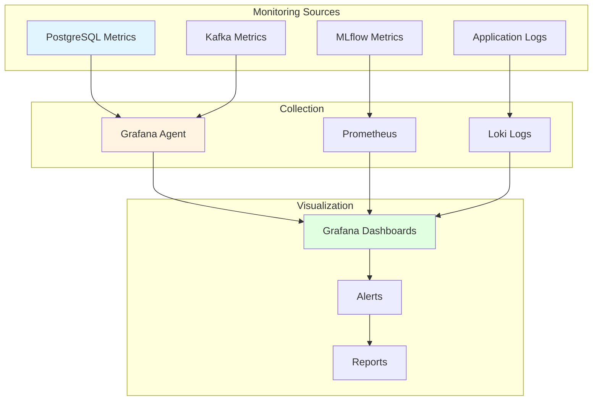

## 🚨 Gestion des Incidents

### Procédure d'Alerte (Non implémenté)

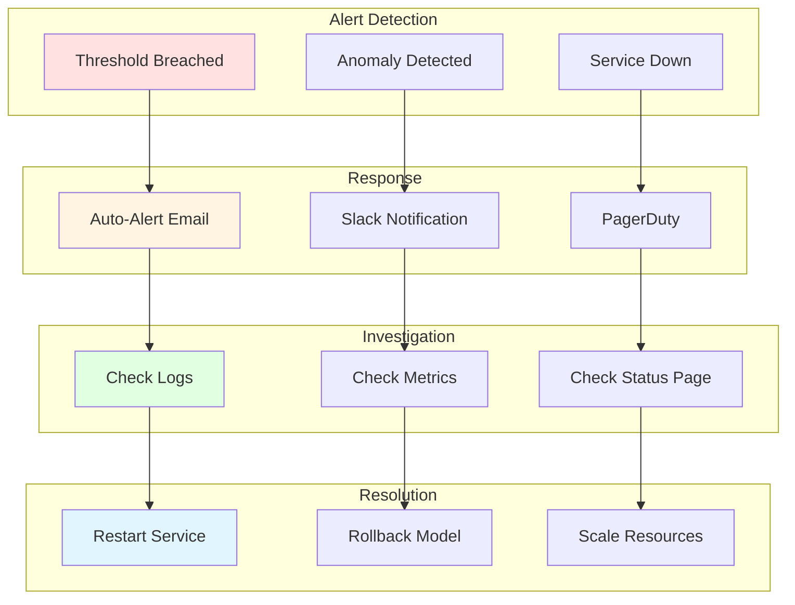

## 📈 Scaling

### Stratégie de Scaling (Non implémenté)

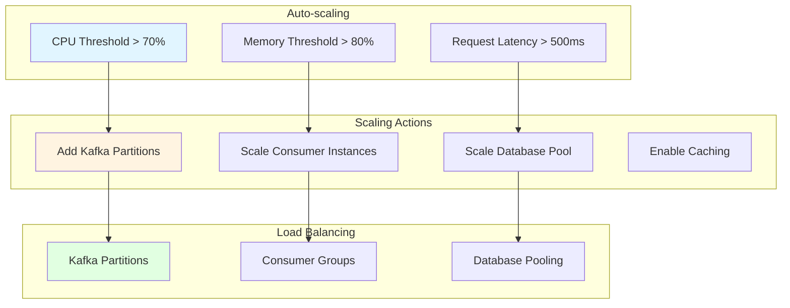

## 🔄 Mises à jour

### Procédure de Déploiement (Non implémenté)

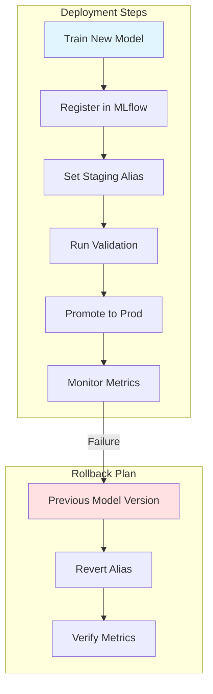

## 📝 Résumé des Endpoints Production

| Service   | URL                                                                                                                                                         | Description        |
| --------- | ----------------------------------------------------------------------------------------------------------------------------------------------------------- | ------------------ |
| API       | https://sdacelo-real-time-fraud-detection.hf.space/                                                                                                         | Endpoint principal |
| MLflow    | https://jefraudai-mlflow.hf.space/#/models                                                                                                                  | Interface MLflow   |
| Producer  | https://huggingface.co/spaces/jefraudai/Producer                                                                                                            | Service Producer   |
| Consumer  | https://huggingface.co/spaces/jefraudai/consumer                                                                                                            | Service Consumer   |
| Kafka     | https://cloud.redpanda.com/clusters/d8c0ur6uk85ifvcgnlrg/topics/real-time-payments/                                                                         | Cluster Redpanda   |
| Dashboard | https://jefraudai.grafana.net/public-dashboards/44a8ad6003bc4887880bfcfb8ebb6598?from=2023-12-04T13:55:58.556Z&to=2028-12-03T13:55:58.556Z&timezone=browser | Grafana Dashboard  |
