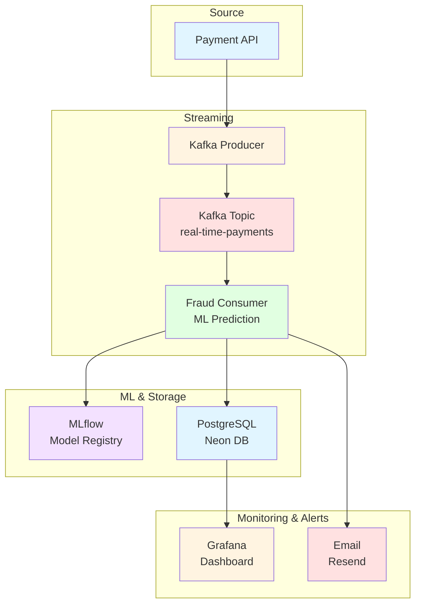
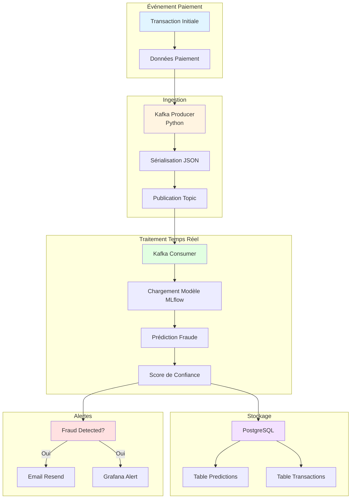
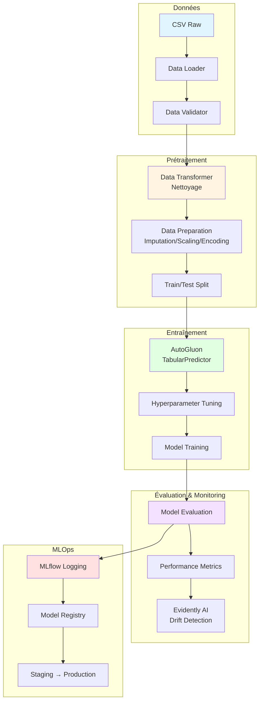
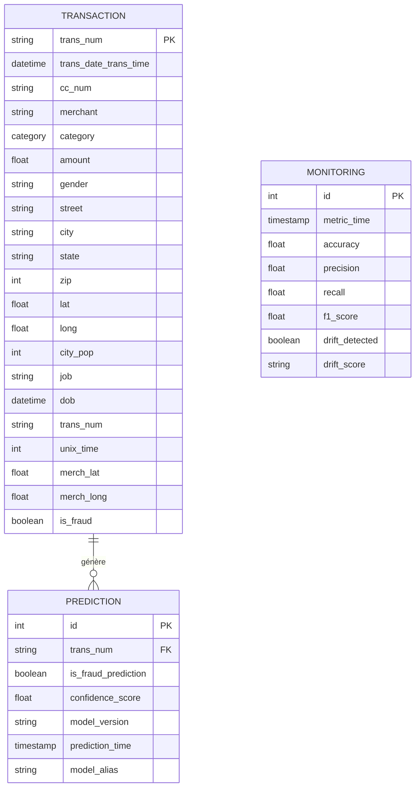
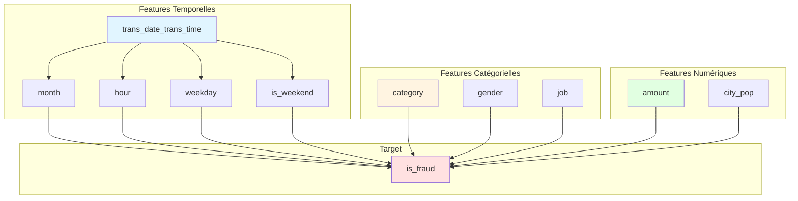
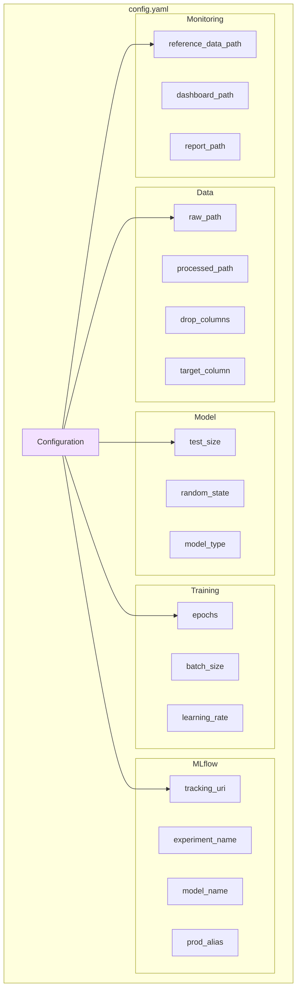
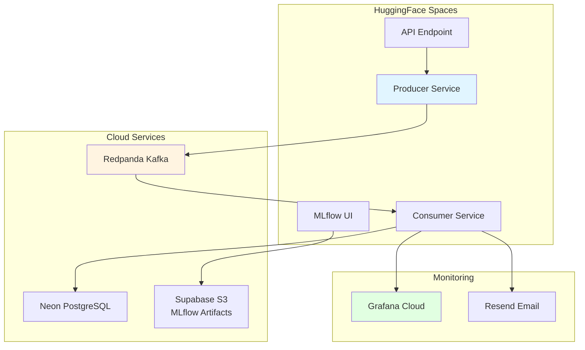

# Automatic Fraud Detection - Documentation

## 📋 Vue d'ensemble

Système de détection de fraude en temps réel utilisant l'IA pour analyser les transactions de paiement et alerter automatiquement en cas de suspicion.

### Objectifs

- Être averti dès qu'une fraude est détectée
- Vérifier quotidiennement tous les paiements et fraudes de la veille
- Pipeline de données temps réel avec monitoring et gouvernance

## 🏗️ Architecture Globale

## 🔄 Flux de Données

## 🧠 Pipeline ML

## 📊 Schéma de Données

### Schéma des Transactions

### Features Utilisées

## 🔧 Configuration

### Structure du Config YAML

## 🚀 Services de Déploiement

### Microservices Architecture

## 📚 Navigation

- [Architecture Détaillée](architecture.md)
- [Schéma de Données](schema.md)
- [Pipeline ML](pipeline.md)
- [API Documentation](api.md)
- [Configuration](configuration.md)
- [Déploiement](deployment.md)
