# Pipeline ML

## 🔄 Pipeline d'Entraînement

### Vue d'ensemble du Pipeline

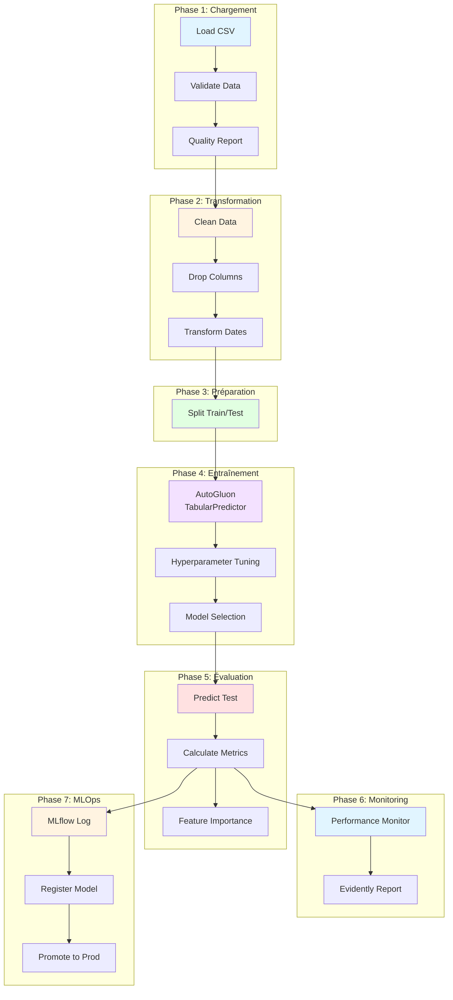

## 📥 Chargement des Données

### Data Loader

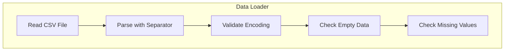

**Fonctionnalités:**
- Chargement depuis CSV avec détection automatique du séparateur
- Validation de l'encodage UTF-8
- Détection des données vides
- Comptage des valeurs manquantes

## ✅ Validation des Données

### Data Validator

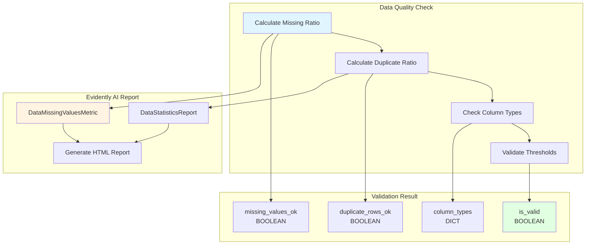

**Seuils de validation:**
- `missing_threshold`: 10% (0.1)
- `duplicate_threshold`: 5% (0.05)

## 🧹 Transformation des Données

### Data Transformer

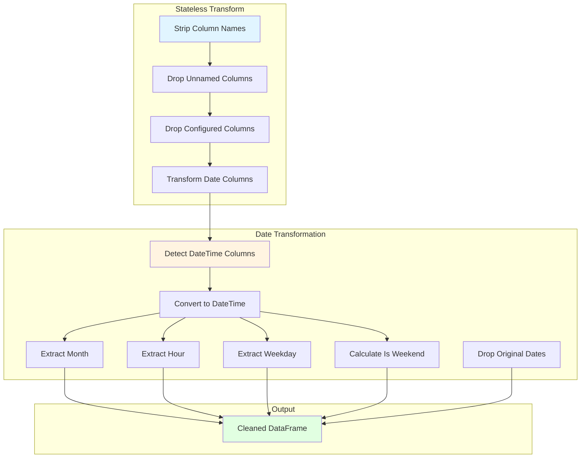

**Colonnes supprimées par défaut:**
```yaml
drop_columns:
  - cc_num
  - merchant
  - first
  - last
  - street
  - trans_num
  - unix_time
  - dob
  - city
  - state
  - lat
  - long
  - merch_lat
  - merch_long
```

## 🔪 Split Train/Test

### Data Splitter

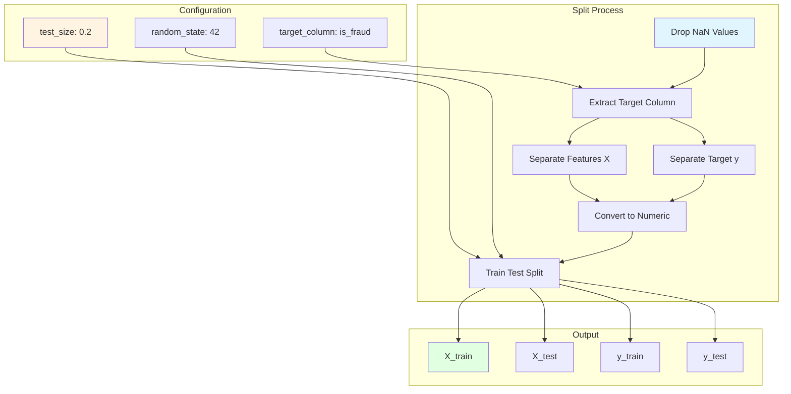

## 🎯 Préparation des Features

### Data Preparation

**Mode AutoGluon (par défaut):**
AutoGluon gère automatiquement la préparation des features. Aucun preprocessing manuel n'est requis:
- Détection automatique des types de colonnes
- Gestion native des features catégorielles
- Imputation des valeurs manquantes
- Scaling automatique selon le modèle

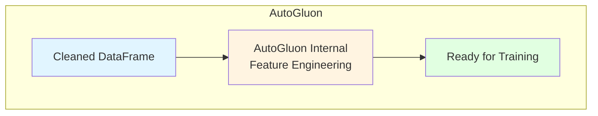

**Mode traditionnel (Random Forest, Linear Regression):**
Pour les modèles non-AutoGluon, un preprocessing manuel est nécessaire:

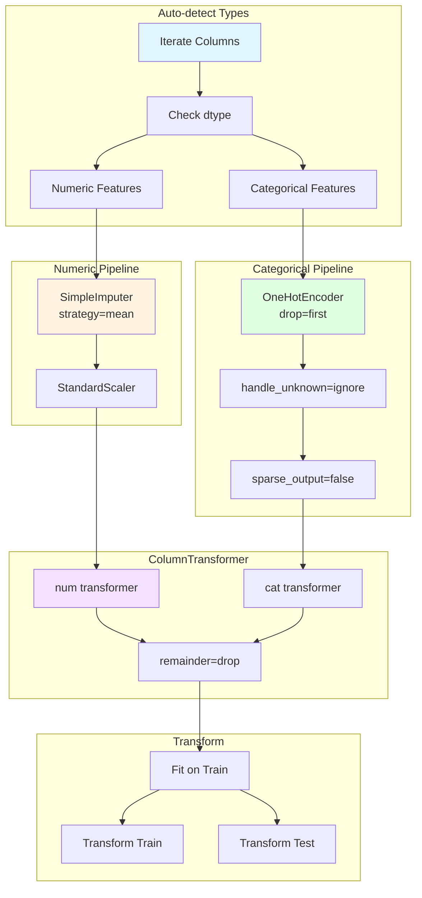

## 🤖 Entraînement du Modèle

### Model Training

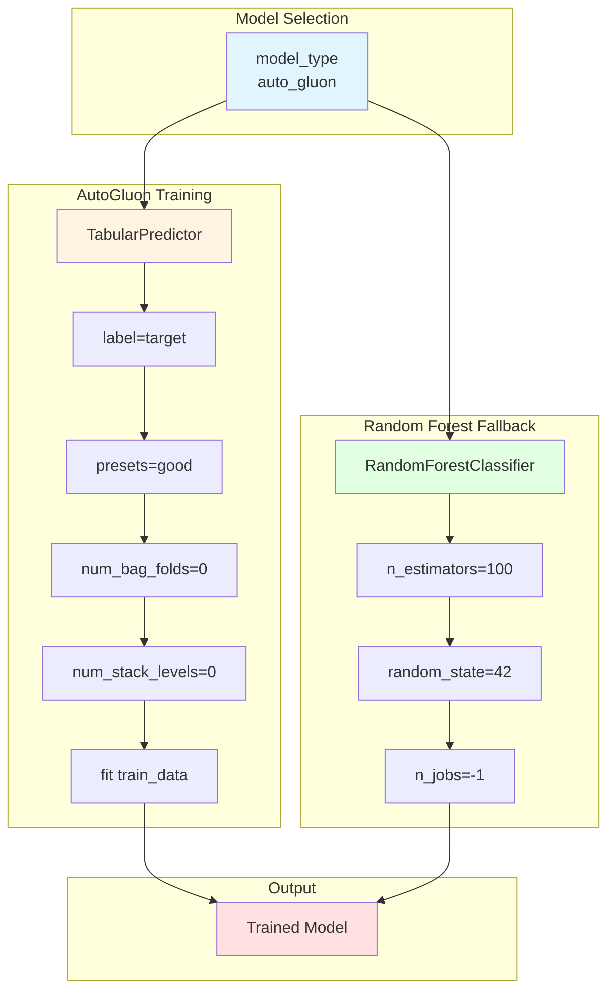

**Types de modèles supportés:**
- `auto_gluon`: AutoML avec AutoGluon Tabular
- `random_forest`: RandomForestClassifier/Regressor
- `linear_regression`: LinearRegression


## 📝 Logging MLflow

### MLflow Tracker

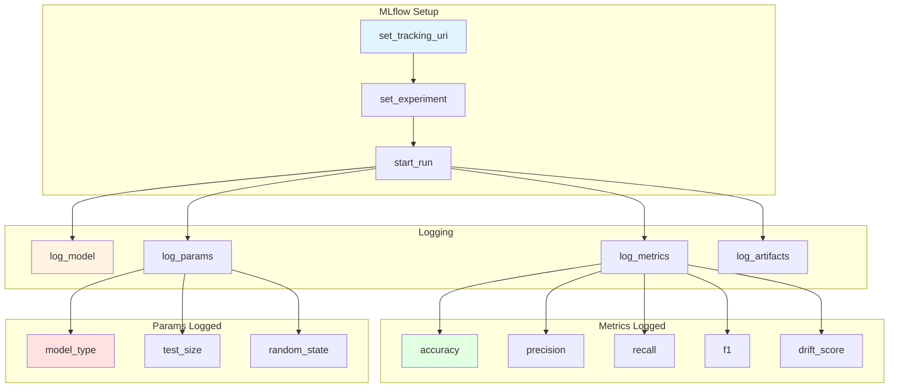


## 🔮 Pipeline d'Inférence

### Prediction Pipeline

```mermaid
graph TD
    subgraph "Setup"
        SU1[Initialize MLflow]
        SU2[Initialize Database]
        SU3[Create Tables]
    end
    
    subgraph "Load Model"
        LM1[load_production_model]
        LM2[alias=prod]
        LM3[get_model_info]
    end
    
    subgraph "Generate Data"
        GD1[generate_inference_data]
        GD2[n_days]
        GD3[n_samples_per_day]
    end
    
    subgraph "Preprocess"
        PP1[prepare_features]
        PP2[transform_new_data]
        PP3[strip_columns]
    end
    
    subgraph "Predict"
        PR1[predict X_inference]
        PR2[get predictions]
        PR3[get confidence_scores]
    end
    
    subgraph "Store"
        ST1[store_predictions]
        ST2[model_version]
        ST3[PostgreSQL]
    end
    
    subgraph "Verify"
        VE1[get_prediction_stats]
        VE2[get_recent_predictions]
    end
    
    SU1 --> SU2
    SU2 --> SU3
    SU3 --> LM1
    LM1 --> LM2
    LM2 --> LM3
    LM3 --> GD1
    GD1 --> GD2
    GD2 --> GD3
    GD3 --> PP1
    PP1 --> PP2
    PP2 --> PP3
    PP3 --> PR1
    PR1 --> PR2
    PR2 --> PR3
    PR3 --> ST1
    ST1 --> ST2
    ST2 --> ST3
    ST3 --> VE1
    VE1 --> VE2
    
    style SU1 fill:#e1f5ff
    style LM1 fill:#fff4e1
    style GD1 fill:#e1ffe1
    style PP1 fill:#f3e1ff
    style PR1 fill:#ffe1e1
    style ST1 fill:#e1f5ff
```

## 📊 Classes du Pipeline

### MLPipeline Class

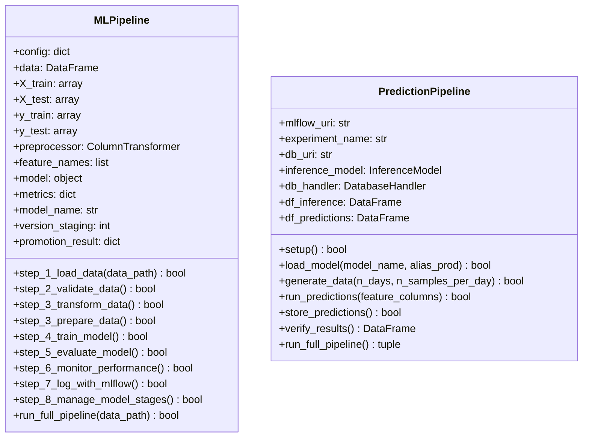
