# Schéma de Données

## 📊 Vue d'ensemble du Schéma

Le système utilise PostgreSQL comme base de données principale pour stocker les transactions et les prédictions de fraude.

## 🗄️ Schéma de Base de Données

### Diagramme Entité-Association

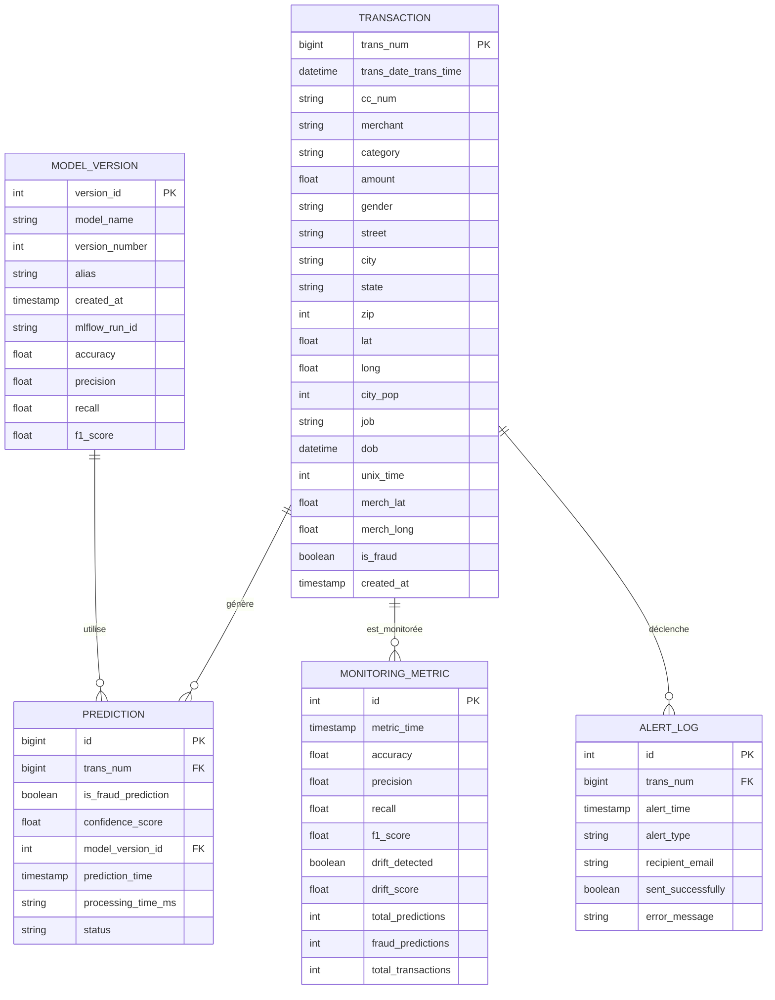

## 📋 Structure des Tables

### Table: TRANSACTION

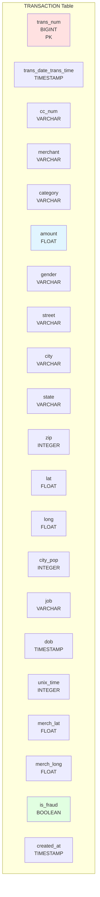

**Colonnes principales:**
- `trans_num`: Identifiant unique de la transaction (clé primaire)
- `trans_date_trans_time`: Date et heure de la transaction
- `amount`: Montant de la transaction
- `category`: Catégorie du marchand
- `is_fraud`: Label de fraude (ground truth)

### Table: PREDICTION

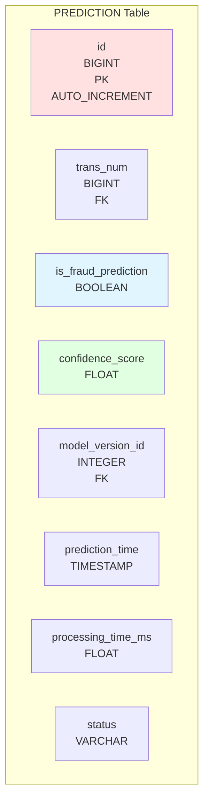

**Colonnes principales:**
- `id`: Identifiant unique de la prédiction
- `trans_num`: Référence vers la transaction
- `is_fraud_prediction`: Prédiction du modèle (0/1)
- `confidence_score`: Score de confiance (0-1)
- `model_version_id`: Version du modèle utilisée
- `processing_time_ms`: Temps de traitement en millisecondes

### Table: MODEL_VERSION

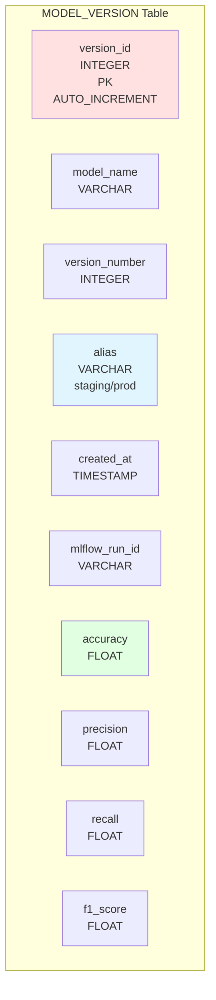

**Colonnes principales:**
- `version_id`: Identifiant unique de la version
- `model_name`: Nom du modèle dans MLflow
- `version_number`: Numéro de version
- `alias`: Alias (staging, prod)
- `mlflow_run_id`: ID de la run MLflow

### Table: MONITORING_METRIC

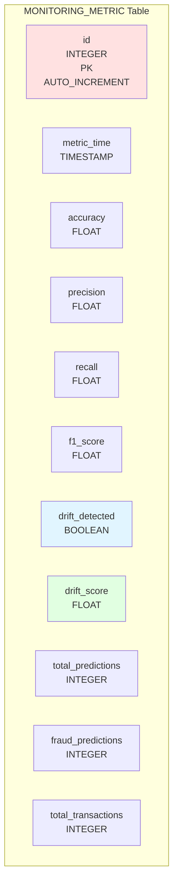

### Table: ALERT_LOG

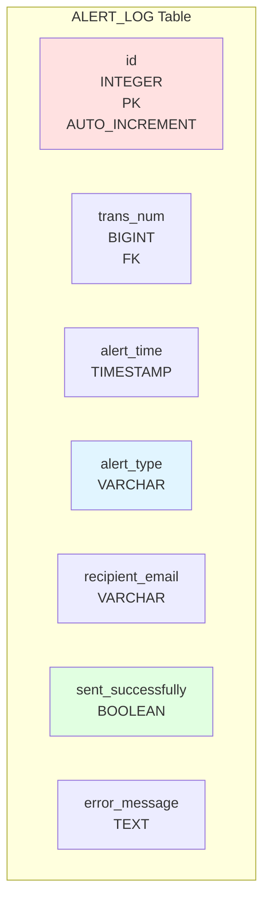

## 🔗 Relations entre Tables

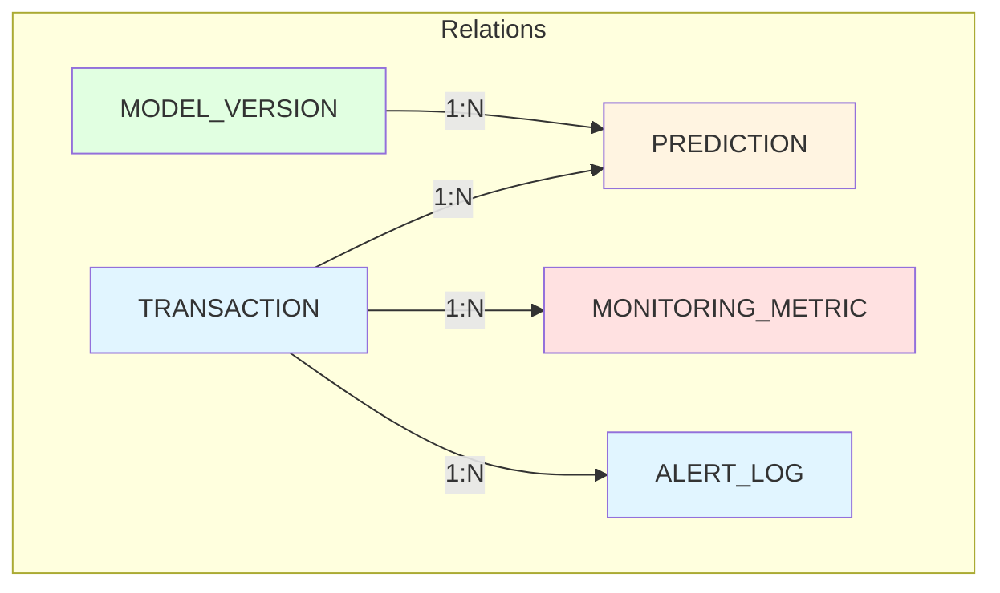

## 📦 Schéma des Données Kafka

### Message Structure (Topic: real-time-payments)

```mermaid
graph TD
    subgraph "Kafka Message Schema"
        K1[message_id<br/>UUID]
        K2[timestamp<br/>ISO8601]
        K3[transaction<br/>OBJECT]
        K4[metadata<br/>OBJECT]
    end
    
    subgraph "Transaction Object"
        T1[trans_num<br/>STRING]
        T2[trans_date_trans_time<br/>STRING]
        T3[cc_num<br/>STRING]
        T4[merchant<br/>STRING]
        T5[category<br/>STRING]
        T6[amount<br/>FLOAT]
        T7[gender<br/>STRING]
        T8[street<br/>STRING]
        T9[city<br/>STRING]
        T10[state<br/>STRING]
        T11[zip<br/>INTEGER]
        T12[lat<br/>FLOAT]
        T13[long<br/>FLOAT]
        T14[city_pop<br/>INTEGER]
        T15[job<br/>STRING]
        T16[dob<br/>STRING]
        T17[unix_time<br/>INTEGER]
        T18[merch_lat<br/>FLOAT]
        T19[merch_long<br/>FLOAT]
    end
    
    subgraph "Metadata Object"
        M1[source<br/>STRING]
        M2[producer_id<br/>STRING]
        M3[partition<br/>INTEGER]
        M4[offset<br/>BIGINT]
    end
    
    K1 --> K3
    K2 --> K4
    K3 --> T1
    K4 --> M1
    
    style K1 fill:#e1f5ff
    style K3 fill:#fff4e1
    style K4 fill:#e1ffe1
```

### Exemple de Message JSON

```json
{
  "message_id": "550e8400-e29b-41d4-a716-446655440000",
  "timestamp": "2024-01-15T10:30:00Z",
  "transaction": {
    "trans_num": "1234567890",
    "trans_date_trans_time": "2024-01-15 10:30:00",
    "cc_num": "************1234",
    "merchant": "Merchant Name",
    "category": "grocery_pos",
    "amount": 150.50,
    "gender": "F",
    "street": "123 Main St",
    "city": "New York",
    "state": "NY",
    "zip": 10001,
    "lat": 40.7128,
    "long": -74.0060,
    "city_pop": 8400000,
    "job": "Engineer",
    "dob": "1990-01-01",
    "unix_time": 1705319400,
    "merch_lat": 40.7138,
    "merch_long": -74.0070
  },
  "metadata": {
    "source": "payment_api",
    "producer_id": "producer-1",
    "partition": 0,
    "offset": 12345
  }
}
```

## 🧪 Schéma des Features ML

### Features d'Entrée du Modèle

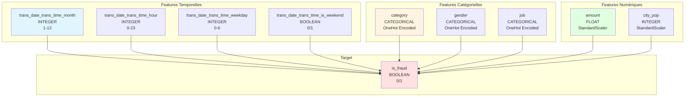

### Pipeline de Prétraitement des Features

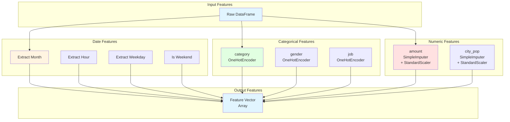

## 📊 Schéma de Monitoring

### Métriques de Performance

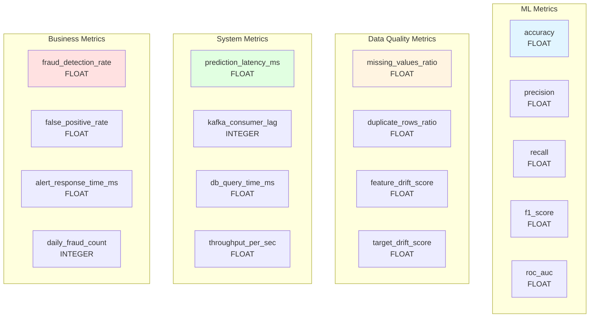

## 🔐 Schéma de Configuration

### Structure du Config YAML

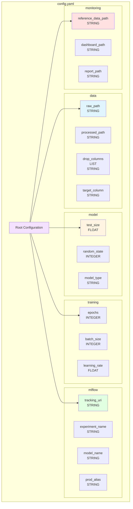

## 📝 Index et Contraintes

### Index de Performance

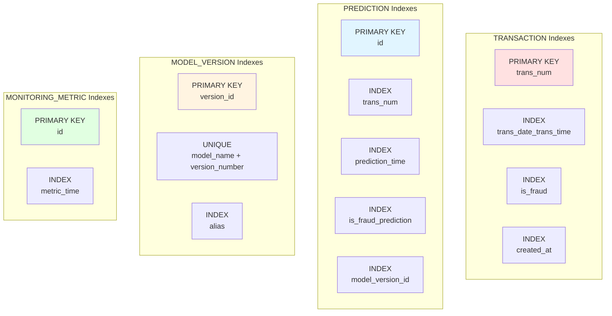
