## Système de Détection de Fraudes en Temps Réel

### Concevoir et mettre en oeuvre des pipelines de données (pour l'IA)
---
transition: fade-out
---

# Enjeux et Solution

<div class="grid grid-cols-2 gap-8 pt-8">

<div>

## 🚨 Enjeu : Réactivité

<div class="text-sm opacity-80 mt-2">

**Problème** : Les fraudes bancaires causent des pertes financières importantes

- Délai de détection = pertes cumulées
- Nécessité d'intervention immédiate
- Impact sur la confiance client

</div>

</div>

<div>

## 📊 Enjeu : Visibilité

<div class="text-sm opacity-80 mt-2">

**Problème** : Manque de visibilité sur les patterns de fraude

- Difficulté d'analyse rétrospective
- Absence de dashboard centralisé
- Besoin d'outils d'investigation

</div>

</div>

</div>
---
transition: fade-out
---

# Solution de détection en temps réel

<div class="grid grid-cols-3 gap-6 pt-8">

<div>

## 📥 Collecte des données

<div class="text-sm opacity-80 mt-2">

**Objectif** : Ingestion continue des transactions

- API Payment en temps réel

</div>

</div>

<div>

## 🚨 Alertes

<div class="text-sm opacity-80 mt-2">

**Objectif** : Être averti dès qu'une fraude est détectée

- Détection instantanée des transactions suspectes
- Notification immédiate par email

</div>

</div>


<div>

## 📊 Rapport quotidien

<div class="text-sm opacity-80 mt-2">

**Objectif** : Pouvoir vérifier chaque matin tous les paiements et fraudes intervenus la veille

- Vue d'ensemble des transactions
- Analyse des tendances de fraude

</div>

</div>

</div>

---
transition: slide-left
---

# Architecture Déployée

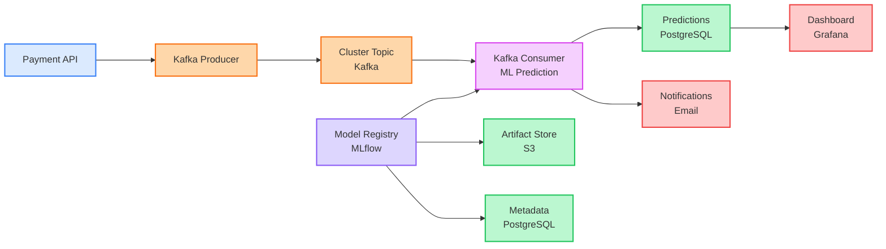

<div class="grid grid-cols-3 gap-4 pt-4 text-xs">

<div>
<span style="display:inline-flex;align-items:center;gap:18px;">
<span style="display:inline-flex;align-items:center;gap:6px;">
    
       
</span>
<span style="display:inline-flex;align-items:center;gap:6px;">
    
    
</span>
<span style="display:inline-flex;align-items:center;gap:6px;">
    
    
</span>
</span>

### Machine Learning

- **AutoML** : AutoGluon
- **MLflow** : Hugging Face Space
  - **S3** : Supabase
  - **PostgreSQL** : Neon

</div>

<div>

<span style="display:inline-flex;align-items:center;gap:18px;">
    <span style="display:inline-flex;align-items:center;gap:6px;">
        
        
    </span>
    <span style="display:inline-flex;align-items:center;gap:6px;">
        
    </span>
    <span style="display:inline-flex;align-items:center;gap:6px;">
        
        
    </span>
</span>

### Streaming Predictions

- **Producer** : Hugging Face Space
- **Kafka Cluster** : Aiven
- **Consumer** : Hugging Face Space
  - **PostgreSQL** : NeonDB

</div>

<div>
<span style="display:inline-flex;align-items:center;gap:6px;">
    
    
</span>

### Monitoring

- **Validation & Performance** : Evidently AI
- **Notification Email** : Resend
- **Dashboard** : Grafana Cloud
</div>

</div>

---
transition: slide-left
---

# Architecture Générale

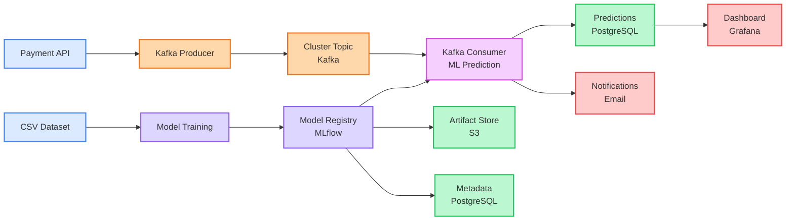

---
transition: slide-left
---

# Architecture Générale

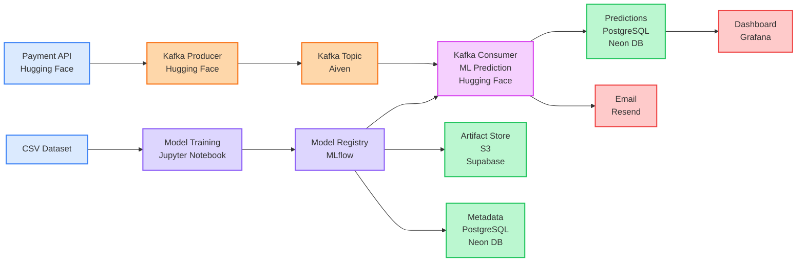

<div class="grid grid-cols-5 gap-2 pt-4 text-sm">

<div style="color:#3b82f6">● Source/API</div>
<div style="color:#f97316">● Kafka</div>
<div style="color:#d946ef">● Consumer</div>
<div style="color:#8b5cf6">● ML</div>
<div style="color:#22c55e">● Storage</div>

</div>
---
transition: slide-left
---

# Technologies Utilisées

<div class="grid grid-cols-2 gap-4 pt-4">

<div>

## Infrastructure Cloud
- **HuggingFace Spaces** : Déploiement API & Consumer
- **Aiven** : Cluster Kafka
- **NeonDB** : PostgreSQL serverless
- **Supabase** : S3 Storage & PostgreSQL
- **Grafana Cloud** : Monitoring
- **Resend** : Emails transactionnels

</div>

<div>

## Machine Learning
- **AutoGluon** : AutoML
- **Scikit-learn** : ML classique
- **Evidently AI** : Monitoring
- **Pandas/NumPy** : Data

</div>

</div>

---
transition: slide-left
---

# Flux de Données Temps Réel

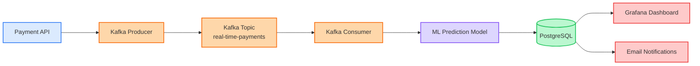

---
transition: slide-left
---

# Pipeline d'Entraînement ML

```mermaid
flowchart LR
    Load[Chargement] ---> Validate[Validation]
    Validate ---> Transform[Transformation]
    Transform ---> Prep[Préparation]
    Prep ---> Train[Entraînement]
    Train ---> Eval[Évaluation]
    Eval ---> Monitor[Monitoring]
    Monitor ---> MLflow[Logging MLflow]
    MLflow ---> Staging[Staging]
    Staging ---> Prod[Production]
    
    style Load fill:#dbeafe,stroke:#3b82f6,stroke-width:2px
    style Validate fill:#dbeafe,stroke:#3b82f6,stroke-width:2px
    style Transform fill:#dbeafe,stroke:#3b82f6,stroke-width:2px
    style Prep fill:#dbeafe,stroke:#3b82f6,stroke-width:2px
    style Train fill:#ddd6fe,stroke:#8b5cf6,stroke-width:2px
    style Eval fill:#ddd6fe,stroke:#8b5cf6,stroke-width:2px
    style Monitor fill:#fecaca,stroke:#ef4444,stroke-width:2px
    style MLflow fill:#ddd6fe,stroke:#8b5cf6,stroke-width:2px
    style Staging fill:#bbf7d0,stroke:#22c55e,stroke-width:2px
    style Prod fill:#bbf7d0,stroke:#22c55e,stroke-width:2px
```

---
transition: slide-left
---

# Étapes du Pipeline d'Entraînement

<v-clicks>

1. **Chargement des données** : Import depuis CSV, validation du format
2. **Validation qualité** : Evidently AI, détection d'outliers
3. **Transformation** : Nettoyage, imputation, encoding, scaling
4. **Entraînement** : AutoGluon avec auto-tuning
5. **Évaluation** : Accuracy, Precision, Recall, F1, ROC-AUC
6. **Monitoring** : Data drift, concept drift
7. **Logging MLflow** : Métriques, paramètres, artefacts
8. **Gestion des stages** : Promotion Staging → Production

</v-clicks>

---
transition: slide-left
---

# Pipeline de Prédiction

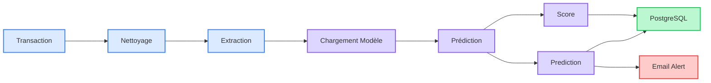

---
transition: slide-left
---

# Kafka Producer

```mermaid
flowchart LR
    API[Payment API] ---> Fetch[Fetch Transaction]
    Fetch ---> Process[Process Data]
    Process ---> Serialize[Serialize JSON]
    Serialize ---> Publish[Publish to Kafka]
    Publish ---> Topic[Topic real-time-payments]
    
    style API fill:#e1f5ff,fill-opacity:0.5
    style Fetch fill:#fff4e1,fill-opacity:0.5
    style Process fill:#fff4e1,fill-opacity:0.5
    style Serialize fill:#fff4e1,fill-opacity:0.5
    style Publish fill:#fff4e1,fill-opacity:0.5
    style Topic fill:#ffe1e1,fill-opacity:0.5
```

**Fonctionnalités** :
- Polling de l'API Payment
- Sécurité SASL_SSL avec SCRAM-SHA-256
- Clé : `trans_num`
- Callbacks succès/erreur

---
transition: slide-left
---

# Kafka Consumer

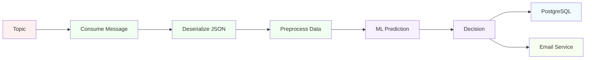

**Fonctionnalités** :
- Consommation temps réel
- Prétraitement des données
- Inférence ML
- Stockage PostgreSQL
- Alertes email si fraude

---
transition: slide-left
---

# MLflow Tracking & Registry

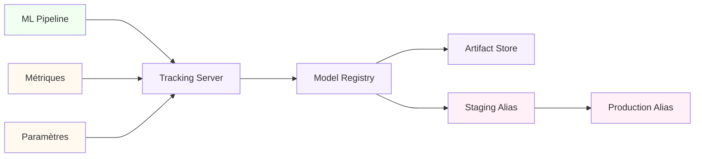

**Fonctionnalités** :
- Tracking des expériences
- Model Registry avec aliases
- Artifact Store sur Supabase S3
- Promotion automatique

---
transition: slide-left
---

# Séquence de Détection de Fraude

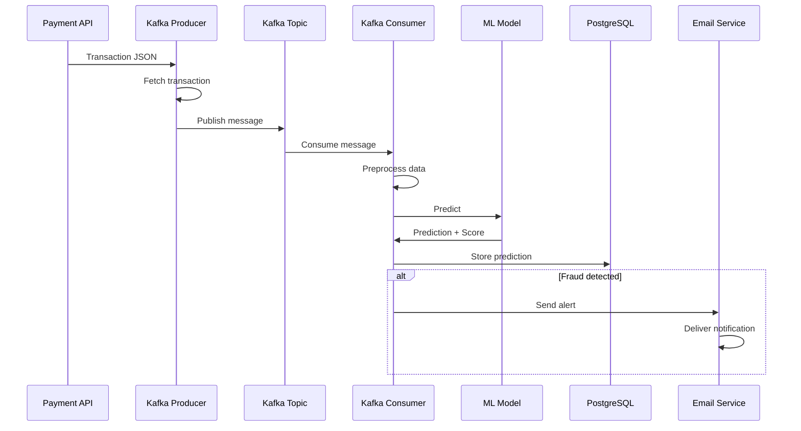

---
transition: slide-left
---

# Architecture de Déploiement

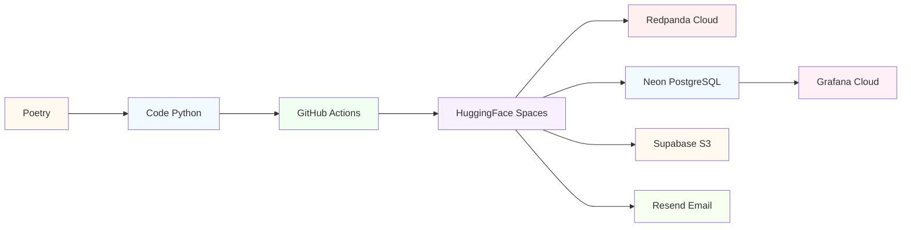

---
transition: slide-left
---

# Services de Production

<div class="grid grid-cols-2 gap-4 pt-4">

<div>

## Déployés sur HuggingFace Spaces
- **API** : https://sdacelo-real-time-fraud-detection.hf.space/
- **MLflow** : https://mlflai-mlflow.hf.space/#/models
- **Producer** : https://huggingface.co/spaces/jefraudai/Producer
- **Consumer** : https://huggingface.co/spaces/jefraudai/consumer

</div>

<div>

## Cloud Services
- **Kafka** : Redpanda Cloud
- **PostgreSQL** : Neon (serverless)
- **S3** : Supabase Storage
- **Monitoring** : Grafana Cloud
- **Email** : Resend API

</div>

</div>

---
transition: slide-left
---

# Monitoring & Observabilité

<v-clicks>

## Grafana Dashboard
- Visualisation des prédictions en temps réel
- Statistiques de fraudes
- Métriques de performance

## Evidently AI
- Data Quality Reports
- Data Drift Detection
- Model Performance Monitoring

## MLflow Tracking
- Expériences ML
- Model Registry
- Artefacts et logs

</v-clicks>

---
transition: slide-left
---

# Sécurité

<v-clicks>

## Authentification Kafka
- Protocole : SASL_SSL
- Mécanisme : SCRAM-SHA-256
- Credentials : Variables d'environnement

## Base de données
- Connection string sécurisée
- SSL/TLS activé

## Secrets Management
- GitHub Secrets pour production
- `.env` pour développement local
- `.env.secrets` non versionné

</v-clicks>

---
transition: slide-left
---

# Scalabilité & Résilience

<v-clicks>

## Horizontal Scaling
- Kafka Consumer : Plusieurs instances
- Kafka Producer : Distribué

## Vertical Scaling
- ML Model : Cache en mémoire
- PostgreSQL : Auto-scaling Neon

## Gestion des erreurs
- Retry automatique API
- Gestion offsets Kafka
- Logs structurés

</v-clicks>

---
transition: slide-left
---

# Structure du Projet

```
jefraudai/
├── src/
│   └── fraud_detection/
│       ├── data/              # Chargement et préparation
│       ├── models/            # Modèles ML et MLflow
│       ├── monitoring/        # Monitoring performance
│       └── pipelines/         # Pipelines ML
├── Services/
│   ├── Producer/              # Kafka Producer
│   ├── consumer/              # Kafka Consumer
│   └── MLflow/                # MLflow Service
├── notebooks/                 # Jupyter Notebooks
├── infra/                     # Infrastructure
└── docs/                      # Documentation
```

---
transition: slide-left
---

# Configuration

```yaml
data:
  target_column: is_fraud
  drop_columns: []

model:
  model_type: auto_gluon
  test_size: 0.2
  random_state: 42

mlflow:
  tracking_uri: "https://mlflai-mlflow.hf.space"
  experiment_name: "fraud_detection"
  model_name: "fraud_model"
  prod_alias: "prod"
  artifact_location: "jefraudai/mlflow"

monitoring:
  report_path: "reports"
```

---
transition: slide-left
---

# Améliorations Futures

<v-clicks>

## À faire
- Vérifier que les fraudes sont détectées

## Améliorations fonctionnelles
- Orchestrateur pour relancer les services

## Améliorations QA
- Nettoyer le code
- Tests unitaires
- Tests d'intégration

## Améliorations infra
- Gérer les variables GitHub
- Docker Compose
- Kubernetes / Helm

## Améliorations ML
- Pipeline de réentraînement automatique

</v-clicks>

---
transition: slide-left
---

# Conclusion

<v-clicks>

## Réalisations
- ✅ Pipeline temps réel avec Kafka
- ✅ Pipeline ML complet avec MLflow
- ✅ Monitoring avec Grafana et Evidently
- ✅ Déploiement sur HuggingFace Spaces
- ✅ Alertes email en temps réel

## Objectifs pédagogiques atteints
- ✅ Gestion de données temps réel
- ✅ Pipeline ETL/ELT
- ✅ Automatisation des flux
- ✅ Surveillance de la qualité
- ✅ Contrôle qualité

</v-clicks>

---
transition: fade-out
---

# Merci de votre attention

<div class="pt-12">
  <span class="text-center">
    Questions ?
  </span>
</div>

<div class="abs-br m-6 flex gap-2">
  <a href="https://github.com/Jenedai/jefraudai" target="_blank" alt="GitHub"
    class="text-xl icon-btn opacity-50 !border-none !hover:text-white">
    <carbon-logo-github />
  </a>
</div>
