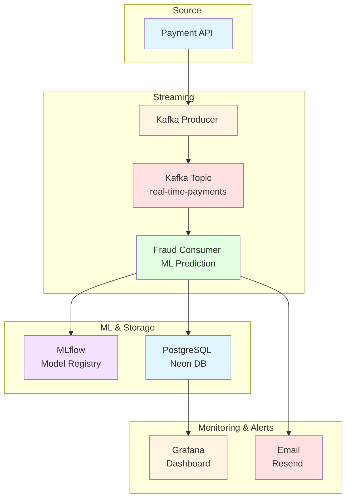

# Automatic Fraud Detection
  
## Besoin fonctionnel

Système de détection de fraude en temps réel utilisant l'IA pour analyser les transactions de paiement et alerter automatiquement en cas de suspicion.
- Être averti en temps réel qu'une fraude est détectée
- Une fois chaque matin, pouvoir vérifier tous les paiements et fraudes intervenus la veille.
  
## Architecture Globale

## Justification des choix d'architecture

### Streaming avec Kafka (Redpanda)
- **Pourquoi** : Traitement temps réel des transactions avec haute scalabilité
- **Avantages** : Découplage producer/consumer, tolérance aux pannes, rétention des messages
- **Alternative écartée** : REST API directe (pas de buffering), Airflow (batch, pas temps réel)
### Microservices (Producer/Consumer séparés)
- **Pourquoi** : Indépendance des services, scaling granulaire
- **Avantages** : Peut scaler le consumer indépendamment du producer, isolation des failures
- **Alternative écartée** : Monolith (difficile à scaler, single point of failure)
### MLflow pour Model Registry
- **Pourquoi** : Gestion du cycle de vie des modèles ML
- **Avantages** : Versioning, staging → promotion, tracking des expériences
- **Alternative écartée** : Stockage manuel (pas de traçabilité, risque d'erreur)
### PostgreSQL (Neon Cloud)
- **Pourquoi** : Base de données relationnelle pour les prédictions
- **Avantages** : ACID, SQL pour les requêtes analytiques, cloud-managed
- **Alternative écartée** : NoSQL (pas nécessaire pour ce schéma simple)
### HuggingFace Spaces
- **Pourquoi** : Déploiement simple de services Python
- **Avantages** : Gratuit, Docker support, CI/CD intégré
- **Alternative écartée** : AWS/GCP (coût)
### Grafana Cloud
- **Pourquoi** : Monitoring centralisé
- **Avantages** : Dashboards temps réel, alertes, intégration PostgreSQL
- **Alternative écartée** : Custom UI (temps de développement)
### Resend pour Email
- **Pourquoi** : Service email transactionnel fiable
- **Avantages** : API simple, deliverability élevée
- **Alternative écartée** : SMTP direct (incompatibilité avec Hugging Face)